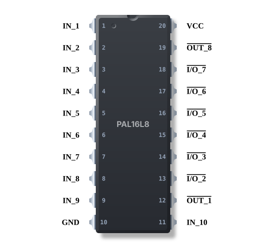
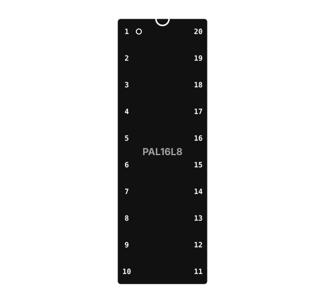

# dipsvg-rs

  

This is a crate that renders DIP-footprint chips to SVG diagrams. It is used by the PALchemy application to render chips in its UI, but I thought it was useful enough to be standalone (I wanted to use it in my mdbook as well).

It depends on the base `palcore` crate, as the parsing of the TOML-based chip definitions lives there, so it may pull in more dependencies than needed. Fork it you hate that.

A half-assed attempt at making rustdocs has been made. Honestly nothing is too complicated here - See the `render_chip.rs` example for how to input a `TOML` file and get an `SVG` file as output.

There are many examples of chip definitions in the root of this repo under `/chips`.

## Notes

### Code Quality

This code is pre-alpha, I've only pushed it because people wanted to use it. Some stuff is stupid. I will inevitibly break the entire API in a refactor.

### Text Rendering Inconsistencies

If you do not embed text as curves (which this utility does not) you are at the mercy of whatever SVG-viewing application decides to do with your text. It might substitute one font for another, it may decide that your baselines are stupid and use different ones. Inconsistent vertical and horizontal alignment between the pins and pin labels may result. I spent enough time trying to account for this between different applications to be able to determine that it was hopeless.

Basically, if you want something to look 100% the same on every platform in every conveivable browser, take the resulting SVG, import it into Inkscape or Affinity, make it look the way you want and export it with 'export text as curves' selected.  The file will be much bigger but your labels will stop shifting around from application to application.

A future version of this crate may perform the necessary conversion for you. Or not! Pull requests accepted.

#### Overbars

dipsvg-rs attempts to render active-low input pin labels with an overbar - this is done via the `text-decoration-line` CSS property set to `overline`.

It will show consistently in browsers, but some vector editors will ignore it (looking at you, Affinity). You may have to just draw the overbar back on. Yes, it can be rendered as a line, but then see the section above for why that ends up not working so well unless you also convert text to curves. Inkscape seems to handle it.

#### Responsive CSS

My eventual goal is to emit responsive CSS so that labels are visible on light and dark themes. Whichever theme you've got set for GitHub right now you probably can only read the labels on one of the images at the top. 

